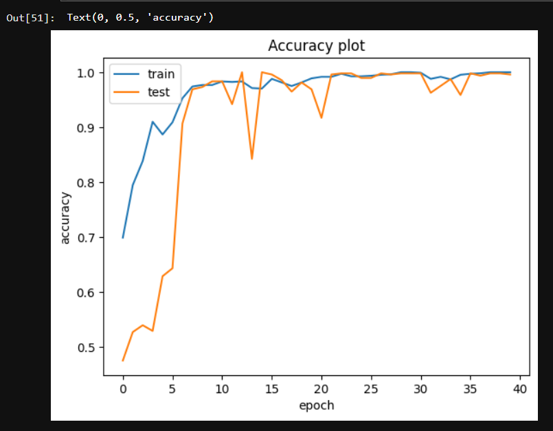
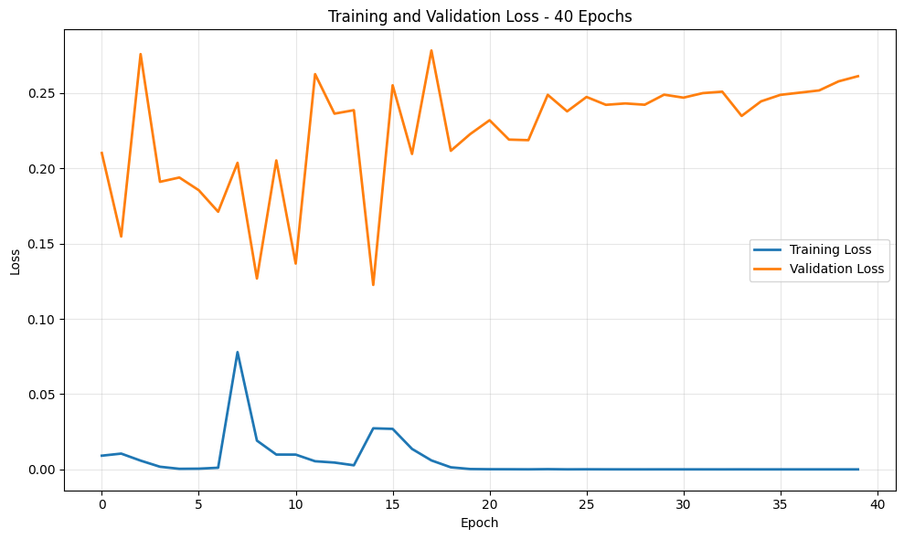
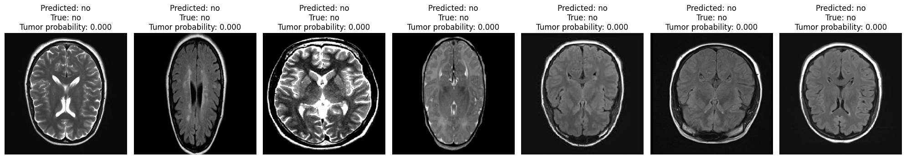

# 🧠 Brain Tumor Detection Using CNN — Improved Version

<p align="center">


</p>

---

## 📌 Overview

This repository is an **improved version of an earlier Brain Tumor Detection CNN project**.

The original project established a complete deep-learning workflow for binary classification of brain MRI images into **Tumor** and **No Tumor** classes. This updated version retains the custom CNN approach while improving the training analysis, evaluation methodology, prediction visualization, error analysis, and model saving workflow.

The project demonstrates an end-to-end image-classification pipeline using **TensorFlow/Keras**, including preprocessing, augmentation, CNN development, training, validation, independent testing, prediction visualization, confusion-matrix analysis, and false-negative analysis.

> **Important:** This project is an educational/research implementation and is not intended for clinical diagnosis.

---

## 🔄 Original Model → Improved Model

The updated implementation builds directly on the original CNN project rather than being a separate project.

| Aspect | Original Version | Improved Version |
|---|---|---|
| Task | Binary classification | Binary classification |
| Model | Custom CNN | Custom CNN |
| Input Size | 256 × 256 | 256 × 256 |
| Optimizer | Adam | Adam |
| Loss | Binary Crossentropy | Binary Crossentropy |
| Training | 40 epochs | 40-epoch training history analyzed |
| Data Augmentation | Horizontal / Vertical Flip | Horizontal / Vertical Flip |
| Evaluation | Basic evaluation | Validation + independent test evaluation |
| Classification | Default prediction rounding | Explicit 0.15 decision threshold |
| Error Analysis | Limited | Dedicated false-negative analysis |
| Prediction Visualization | Predicted / actual labels | Predicted / actual labels + tumor probability |
| Test Set | Earlier evaluation setup | Separate 100-image test set |
| Model Saving | `.h5` | `.keras` |
| Training Analysis | Accuracy / loss curves | Accuracy / loss curves with overfitting analysis |

---

## ✨ Features

- Binary Brain Tumor Classification
- MRI Image Processing
- Image Data Augmentation
- Custom CNN Architecture
- Batch Normalization
- Max Pooling
- Adam Optimizer
- Binary Crossentropy Loss
- Training and Validation Accuracy Visualization
- Training and Validation Loss Visualization
- Classification Report
- Confusion Matrix
- Independent Test Set Evaluation
- Prediction Visualization
- Tumor Probability Reporting
- False-Negative Analysis
- Final Model Saving in `.keras` format

---

## 🎯 Objectives

The project aims to:

- Develop a CNN capable of classifying MRI images into Tumor and No Tumor categories.
- Explore deep learning techniques for medical image classification.
- Analyze model learning behaviour using training and validation curves.
- Evaluate model performance using precision, recall, F1-score, accuracy, and confusion matrices.
- Investigate false-negative predictions.
- Evaluate the final model on a separate set of previously unseen MRI images.
- Demonstrate an end-to-end TensorFlow/Keras image-classification workflow.

---

## 🧰 Technologies Used

| Category | Technologies |
|---|---|
| Programming Language | Python |
| Deep Learning | TensorFlow, Keras |
| Computer Vision | OpenCV |
| Data Processing | NumPy, Pandas |
| Visualization | Matplotlib, Seaborn |
| Machine Learning | Scikit-learn |
| Development Environment | Jupyter Notebook / Google Colab |

---

## 📂 Dataset

The project uses brain MRI images belonging to two classes:

- 🧠 **Tumor**
- 🧠 **No Tumor**

The images are loaded using Keras `ImageDataGenerator`.

### Data Preprocessing

The preprocessing pipeline includes:

- Image resizing to **256 × 256 pixels**
- RGB image format
- Pixel rescaling using `1/255`
- Horizontal flipping
- Vertical flipping
- Validation split
- Batch-based image loading

---

## 📁 Repository Structure

```text
Brain-Tumor-Detection-Model/
│
├── README.md
├── brain_tumor.ipynb
├── brain_tumorDetectionUsingCNN.ipynb
├── archive_2.zip
├── accuracy.png
├── loss.png
├── confusion matrix.png
├── predictions.png
└── LICENSE
```

### Main Files

| File | Description |
|---|---|
| `brain_tumor.ipynb` | Earlier experimentation notebook |
| `brain_tumorDetectionUsingCNN.ipynb` | Improved CNN implementation, training, evaluation, error analysis, and prediction |
| `accuracy.png` | Training and validation accuracy curve |
| `loss.png` | Training and validation loss curve |
| `confusion matrix.png` | Confusion matrix visualization |
| `predictions.png` | Sample prediction visualization |
| `archive_2.zip` | Original dataset archive |
| `README.md` | Project documentation |

---

## 🚀 Project Workflow

```text
MRI Images
    │
    ▼
Data Preprocessing
    │
    ▼
Data Augmentation
    │
    ▼
Custom CNN
    │
    ▼
40-Epoch Training
    │
    ▼
Training / Validation Curves
    │
    ▼
Restore Final Saved Model
    │
    ▼
Validation Evaluation
    │
    ├── Classification Report
    ├── Confusion Matrix
    └── False-Negative Analysis
    │
    ▼
Independent Test Set
    │
    ├── Predictions
    ├── Prediction Images
    ├── Classification Report
    └── Confusion Matrix
    │
    ▼
Final Model
```

---

# 🧠 CNN Model Architecture

The project uses a custom Convolutional Neural Network designed for binary MRI image classification.

### Model Pipeline

```text
Input Image (256 × 256 × 3)
        │
        ▼
Convolution
        │
        ▼
Batch Normalization
        │
        ▼
Max Pooling
        │
        ▼
Convolution
        │
        ▼
Batch Normalization
        │
        ▼
Max Pooling
        │
        ▼
Convolution
        │
        ▼
Batch Normalization
        │
        ▼
Max Pooling
        │
        ▼
Convolution
        │
        ▼
Batch Normalization
        │
        ▼
Max Pooling
        │
        ▼
Flatten
        │
        ▼
Dense (128)
        │
        ▼
Dense (128)
        │
        ▼
Dense (64)
        │
        ▼
Dense (1, Sigmoid)
        │
        ▼
Tumor / No Tumor
```

### Output

The final sigmoid output represents the model's estimated probability of the Tumor class.

```text
0 → No Tumor
1 → Tumor
```

---

# ⚡ Model Compilation

| Parameter | Value |
|---|---|
| Optimizer | Adam |
| Loss Function | Binary Crossentropy |
| Evaluation Metric | Accuracy |

---

# 🔄 Data Augmentation

The training pipeline applies:

- Rescaling (`1/255`)
- Horizontal flipping
- Vertical flipping

These transformations increase variation in the training images and help the model learn more robust visual features.

---

# 🎯 Training Configuration

The CNN was trained for **40 epochs** to obtain a complete training history for analysis.

| Parameter | Value |
|---|---|
| Epochs | 40 |
| Image Size | 256 × 256 |
| Color Mode | RGB |
| Training Shuffle | Enabled |
| Validation Data | Yes |
| Batch Size | 16 |

The 40-epoch run was retained for visualization and analysis of training behaviour. The final saved model was restored separately before final validation and test evaluation.

---

# 📈 Training Performance

The 40-epoch training curves provide insight into how the CNN learned over time.

## Training and Validation Accuracy



The model's training accuracy eventually approached 100%, while validation accuracy remained lower and fluctuated. The divergence between training and validation performance indicates signs of **overfitting during later epochs**.

## Training and Validation Loss



Training loss decreased substantially during training, approaching zero in later epochs. Validation loss, however, fluctuated and increased after reaching lower values earlier in training. This further demonstrates the difference between training performance and generalization performance.

The curves are retained to provide transparency into the model's learning behaviour rather than presenting only the final test result.

---

# 🔍 Validation Evaluation

The validation dataset was evaluated using model prediction probabilities and an explicitly selected classification threshold of **0.15**.

The validation evaluation includes:

- Precision
- Recall
- F1-score
- Accuracy
- Confusion matrix
- False-negative identification

### False-Negative Analysis

False negatives are cases where:

```text
Actual: Tumor
Predicted: No Tumor
```

Because missed tumor cases are particularly important in this classification task, the improved notebook explicitly identifies these cases.

The corresponding MRI images are displayed together with their predicted tumor probabilities, allowing further qualitative inspection of model behaviour.

---

# 🖼️ Prediction Visualization

The improved notebook displays sample predictions using:

- Predicted class
- True class
- Tumor probability



This provides a qualitative complement to the numerical evaluation metrics.

---

# 📊 Final Independent Test Evaluation

A separate test dataset was used for final evaluation.

### Test Dataset

| Class | Images |
|---|---:|
| No Tumor | 50 |
| Tumor | 50 |
| **Total** | **100** |

The test generator uses `shuffle=False` so that predictions remain aligned with the corresponding labels and image filenames during analysis.

---

## 📊 Original vs Improved Results

The improved implementation should be viewed as an iteration on the original project. The two reported results were obtained under different evaluation setups, so the comparison is intended to show the development of the project rather than a controlled benchmark on the same test set.

| Metric | Original Model | Improved Model |
|---|---:|---:|
| Reported Accuracy | **56%** | **100%*** |
| Evaluation/Test Images | 16 | 100 |
| False Positives | 4 | 0 |
| False Negatives | 3 | 0 |
| Confusion Matrix | `[[5, 4], [3, 4]]` | `[[50, 0], [0, 50]]` |
| Decision Threshold | Default | 0.15 |
| Error Analysis | Limited | False-negative analysis |
| Prediction Probability | Not reported | Reported |
| Model Format | `.h5` | `.keras` |

\* The improved model achieved 100% accuracy on the 100-image test set used in this project. This result should not be interpreted as clinical accuracy or guaranteed real-world generalization. The original and improved results were obtained on different evaluation setups and therefore should not be treated as a direct controlled comparison.

## Final Test Results

The final saved model achieved the following result on the 100-image test set:

| Metric | Result |
|---|---:|
| Total Test Images | **100** |
| No Tumor | **50** |
| Tumor | **50** |
| Accuracy | **100%** |
| False Positives | **0** |
| False Negatives | **0** |

### Confusion Matrix

```text
[[50  0]
 [ 0 50]]
```


The model correctly classified all 100 images in this particular test set.

> **Important:** The 100% accuracy reported here was obtained on a 100-image test set. It should not be interpreted as clinical accuracy or proof of real-world diagnostic reliability. Larger, independently collected, and clinically validated datasets would be required to establish generalization performance.

---

# 💾 Model Saving

The final model is saved using the modern Keras format:

```python
model.save("Modelcnn.keras")
```

It can later be loaded using:

```python
from tensorflow.keras.models import load_model

model = load_model("Modelcnn.keras")
```

---

# ▶️ Usage

To reproduce the project:

1. Clone the repository.
2. Install the required Python dependencies.
3. Prepare the dataset.
4. Open `brain_tumorDetectionUsingCNN.ipynb`.
5. Execute the notebook cells sequentially.
6. Train the CNN.
7. Review the training and validation curves.
8. Evaluate the validation set.
9. Inspect false-negative predictions.
10. Evaluate the independent test set.

---

# 💡 Key Learnings

This project provided practical experience with:

- Medical image preprocessing
- Image augmentation
- Convolutional Neural Networks
- Batch Normalization
- Max Pooling
- Binary classification
- Adam optimization
- Binary Crossentropy
- Model evaluation
- Classification metrics
- Confusion-matrix analysis
- False-negative analysis
- Probability-based prediction thresholds
- Training-curve analysis
- TensorFlow/Keras model saving and loading

---

# ⚠ Limitations

Despite the improved evaluation pipeline, the project has several limitations:

- The classification task is limited to Tumor / No Tumor.
- The independent test set contains only 100 images.
- The dataset may not represent the diversity of real-world MRI scans.
- The observed 100% test accuracy may not generalize to external datasets.
- The model does not provide clinical explainability.
- No Grad-CAM or other visual explanation method is currently implemented.
- No external clinical validation has been performed.

---

# 🚀 Future Improvements

Potential future improvements include:

- Transfer learning using VGG16, VGG19, ResNet50, EfficientNet, or DenseNet.
- Larger and more diverse datasets.
- Multiclass classification of different brain tumor types.
- Grad-CAM for model interpretability.
- ROC-AUC and Precision-Recall analysis.
- Stratified cross-validation.
- Systematic threshold tuning using validation data.
- Hyperparameter optimization.
- External dataset evaluation.
- Development of a Streamlit or FastAPI inference application.
- Deployment of the trained model.

---

# 📚 References

- TensorFlow Documentation
- Keras Documentation
- OpenCV Documentation
- Scikit-learn Documentation
- Brain MRI image dataset used during development

---

# 👩‍💻 Author

**Drishti Saha**

GitHub:  
https://github.com/drishtiiii

---

# 📄 License

This project is licensed under the MIT License.

Feel free to use, modify, and distribute the project for educational and research purposes.
